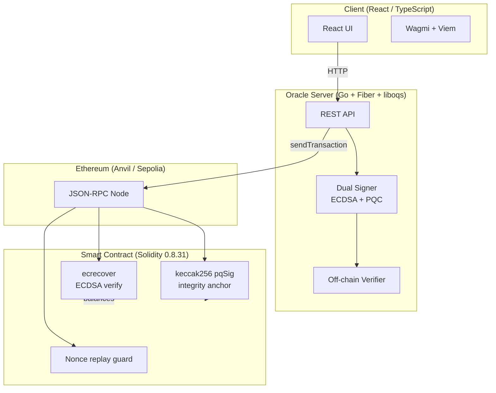

# Hybrid Post-Quantum Signatures on Ethereum

A hybrid **ECDSA + PQC** transaction signature scheme for EVM blockchains. Combines Secp256k1 ECDSA (EVM-native) with post-quantum algorithms from [liboqs](https://openquantumsafe.org/) via an oracle/relayer architecture.

**Core idea:** For each transaction, the oracle builds a canonical hash from `(chainId, nonce, sender, receiver, algorithm, mode, message, amount)` and signs it twice — once with ECDSA, once with PQC. The contract verifies ECDSA on-chain via `ecrecover` and stores `keccak256(pqSig)` as a tamper-evident anchor.

## Features

- **11 PQC algorithms** — ML-DSA-44/65/87, Falcon-512/1024, MAYO-1/3/5, SNOVA variants
- **Dual signing modes** — single (ECDSA or PQC) and hybrid (ECDSA + PQC)
- **TLV wire format** — self-describing binary encoding (`HYBS` magic, version, tagged fields)
- **54 security tests** — 39 Go + 15 Foundry covering stripping, substitution, replay, forgery, malleability, reentrancy
- **23-scenario benchmark suite** — sign/verify latency, gas estimation, throughput, keygen timing

## Architecture



| Layer    | Technology                            | Role                                                 |
| -------- | ------------------------------------- | ---------------------------------------------------- |
| Client   | React 19, Wagmi, Viem, TanStack Query | Wallet connect, keypair gen, tx submission           |
| Oracle   | Go, Fiber, liboqs, go-ethereum        | Dual signing, off-chain verification, tx relay       |
| Contract | Solidity 0.8.31, Foundry              | On-chain ECDSA verify, balance mgmt, PQC hash anchor |

## Quick Start

### Docker Compose (recommended)

```bash
just dev
```

| Service | URL                     | Purpose                  |
| ------- | ----------------------- | ------------------------ |
| Anvil   | `http://localhost:8540` | Local Ethereum node      |
| Oracle  | `http://localhost:9000` | Signing/verification API |
| Client  | `http://localhost:5173` | React UI                 |

```bash
just dev-down    # stop
just dev-logs    # tail logs
```

### Local Development

```bash
just run-node                        # 1. Start Anvil
just compile-contract                # 2. Compile contract + Go bindings
just forge-deploy KEY=0x... ADDR=0x...  # 3. Deploy
just run-oracle-with ADDR=0x...      # 4. Start oracle
just run-client                      # 5. Start client
```

## Development

### Task Runner

All tasks are defined via `just` (replaces Make). Run `just` to see all recipes.

| Command                 | Description                    |
| ----------------------- | ------------------------------ |
| `just dev`              | Docker Compose full stack      |
| `just run-node`         | Start Anvil                    |
| `just run-oracle`       | Start oracle server            |
| `just run-client`       | Start client dev server        |
| `just compile-contract` | Compile Solidity → Go bindings |
| `just test-security`    | Run all security tests         |
| `just benchmark`        | Run performance benchmarks     |

### Prerequisites

- Go ≥ 1.25, liboqs-dev, Foundry, pnpm ≥ 9, just ≥ 1, Docker (optional)

```bash
sudo apt install liboqs-dev
curl -L https://foundry.paradigm.xyz | bash && foundryup
```

## Known Limitations

1. **No cross-component key commitment** — ECDSA and PQC verified independently; an adversary can combine a stolen ECDSA sig with their own PQC sig. _Mitigation:_ bind `hash(pqcPublicKey)` into the signed payload.
2. **No `verifyingContract` in signed payload** — signs `chainId` but not contract address. _Mitigation:_ adopt EIP-712 or bind contract address explicitly.
3. **Trusted oracle** — compromised oracle key can submit arbitrary transactions. _Mitigation:_ multi-oracle threshold signing, or on-chain PQC verification once EVM precompiles exist.
